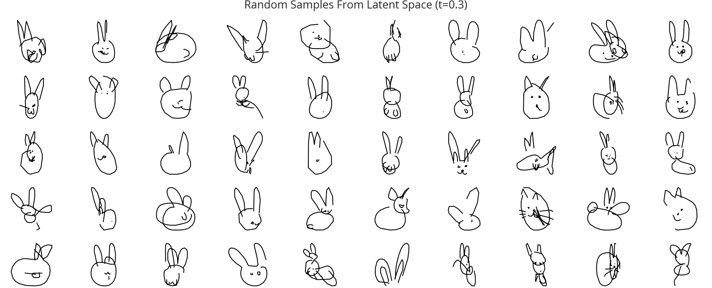
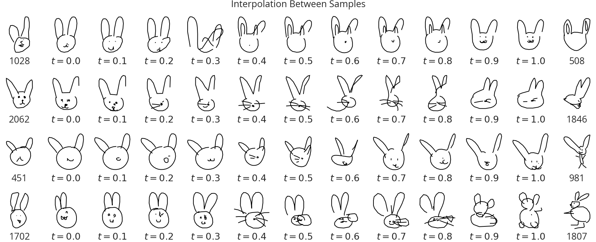
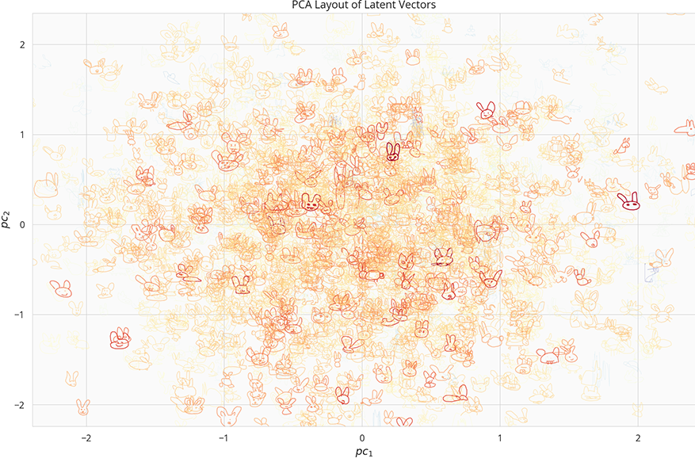

# SketchRNN Implementation In Tensorflow 2
 
This repo contains a simple implementation of the SketchRNN model with Tensorflow 2, following the best practice as much as possible.


## Setup

### Prerequisite

* pyenv
* pipenv

### Installation

After cloning the repo, run the following commands to setup

```sh
pipenv install --dev --skip-lock
pipenv shell
```

## Usage

### Training

See the [colab notebook](notebooks/train.ipynb) for an example train on the rabbit dataset.

### Results

Here are some results from a model trained on the rabbit dataset.









See complete examples in the [usage.ipynb](notebooks/usage.ipynb).

## References

* [A Neural Representation of Sketch Drawings](https://arxiv.org/abs/1704.03477) - Original Paper
* [Teaching Machines to Draw](http://blog.otoro.net/2017/05/19/teaching-machines-to-draw/) - Official blog post
* [googlecreativelab/quickdraw-dataset](https://github.com/googlecreativelab/quickdraw-dataset) - The QuickDraw dataset
* [magenta/models/sketch_rnn](https://github.com/tensorflow/magenta/tree/master/magenta/models/sketch_rnn) - Official Implementation
* [hardmaru/sketch-rnn](https://github.com/hardmaru/sketch-rnn) - Original Implementation from the author of the paper @hardmaru

* [eyalzk/sketch_rnn_keras](https://github.com/eyalzk/sketch_rnn_keras) - Implementation based on Keras by @eyalzk

* [zzh8829/yolov3-tf2](https://github.com/zzh8829/yolov3-tf2) - Great source for some TF2 features in practice.